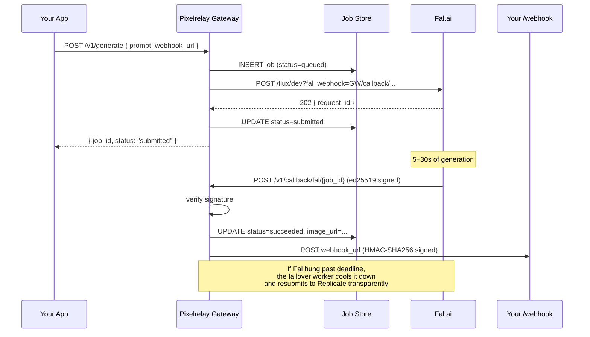

# Pixelrelay

[](LICENSE)
[](https://www.python.org)
[](https://github.com/SamurAIGPT/pixelrelay)
[](https://github.com/SamurAIGPT/pixelrelay/issues)

**Route AI image and video generation across 35+ models with one webhook-native, BYOK API. Self-hosted, open source.**

- ⚡ **One async endpoint across all providers** — webhook-first, not polling
- 🔑 **Bring your own keys, run it next to your app** — no billing layer, no markup, no lock-in
- 🛟 **Persistent jobs + automatic failover** — survives restarts, scales horizontally, transparent provider switching when one goes down

---

## Quickstart (60 seconds)

```bash
docker run -p 8000:8000 \
  -e PIXELRELAY_GATEWAY_KEY=$(openssl rand -hex 32) \
  -e PIXELRELAY_PUBLIC_URL=https://your-tunnel.example.com \
  -e FAL_KEY=$FAL_KEY \
  -e REPLICATE_API_TOKEN=$REPLICATE_API_TOKEN \
  -v pixelrelay_data:/data \
  ghcr.io/samuraigpt/pixelrelay
```

```bash
curl -X POST http://localhost:8000/v1/generate \
  -H "Authorization: Bearer $PIXELRELAY_GATEWAY_KEY" \
  -H "Content-Type: application/json" \
  -d '{
    "prompt": "cinematic portrait of a woman in paris",
    "model": "flux-1.1-pro",
    "providers": ["fal", "replicate"],
    "webhook_url": "https://your-app.example.com/pixelrelay-webhook"
  }'
# → { "job_id": "...", "status": "submitted", "provider": "fal", ... }
```

When the job finishes, your `webhook_url` receives a signed POST with the result. **No polling on your side.**

> `PIXELRELAY_PUBLIC_URL` must be reachable by Fal/Replicate to deliver the callback. For local dev, expose with `ngrok http 8000` or `cloudflared tunnel`.

---

## What it gives you

| | |
|---|---|
| **Unified API** | One endpoint, one auth header — talks to Fal, Replicate, and (soon) RunPod, Stability, Runway. Same request shape across providers. |
| **Webhooks-first** | Provider POSTs the result asynchronously; the gateway forwards it to your `webhook_url`. No client-side polling, no held connections. |
| **Persistent jobs** | Job state in SQLite (default) or Postgres. Survives restarts, shared across replicas, full audit trail at `GET /v1/jobs`. |
| **Automatic failover** | Provider down or hung past deadline? The gateway cools it down and resubmits to the next one — your app never sees the error. |
| **BYOK, self-hosted** | You run it, you own the data, you keep your provider rate limits. No billing layer, no markup, no lock-in. |
| **Verified model registry** | 35+ image models — every slug verified against fal.ai / replicate.com live pages. Unknown slugs pass through. |

---

## How it works



---

## Why a gateway, not just an SDK

A polling SDK breaks at production scale because:

1. **Process lifecycle** — your request handler holds open for the entire job duration (10–300s for video). One restart loses state. Serverless function timeouts kill long polls.
2. **State doesn't share** — cooldown lives in one Python process. 50 workers = 50 independent cooldown trackers.
3. **Failover wastes the request budget** — if Fal hangs for 4 minutes before failover, your user already lost 4 minutes.

The gateway fixes all three: persistent DB-backed state, webhook callbacks instead of polling, cooldown shared across replicas, transparent forwarding to your webhook.

---

## Compared to alternatives

| | Pixelrelay | Portkey / LiteLLM | Provider SDKs (replicate, fal-client, …) |
|---|:---:|:---:|:---:|
| Open source | ✅ Apache 2.0 | ✅ MIT / Apache | ✅ |
| Self-hosted | ✅ | ✅ | n/a |
| BYO keys (direct to provider) | ✅ | ✅ | ✅ |
| Media-native (image + video) | ✅ | ❌ LLM-first | single provider |
| Webhook-native (no polling) | ✅ | ❌ sync | mixed |
| Persistent jobs (DB-backed) | ✅ | ❌ in-process | ❌ |
| Multi-provider failover | ✅ | ✅ (LLMs) | ❌ |

**Use Pixelrelay if** you want a media-gen gateway you fully own, with webhooks, persistence, and failover across providers — without writing the orchestration yourself.

---

## Install

```bash
# Gateway + library
pip install "pixelrelay[gateway]"

# Library only (in-process polling, scripts/notebooks)
pip install pixelrelay
```

---

## Run the gateway

### Docker (recommended)

```bash
cd docker
cp .env.example .env
# Edit .env: set PIXELRELAY_GATEWAY_KEY, PIXELRELAY_PUBLIC_URL, FAL_KEY, REPLICATE_API_TOKEN
docker compose up -d
```

### From source

```bash
pip install "pixelrelay[gateway]"
export PIXELRELAY_GATEWAY_KEY=$(openssl rand -hex 32)
export PIXELRELAY_PUBLIC_URL=https://gateway.example.com
export FAL_KEY=...
export REPLICATE_API_TOKEN=...
python -m pixelrelay.gateway
```

### Configuration

| Env var | Default | Notes |
|---|---|---|
| `PIXELRELAY_GATEWAY_KEY` | (required) | Bearer token clients use to authenticate |
| `PIXELRELAY_AUTH` | (unset) | Set to `none` to disable auth (local dev only) |
| `PIXELRELAY_PUBLIC_URL` | `http://localhost:8000` | URL Fal/Replicate POST callbacks back to. Must be reachable from the public internet. |
| `DATABASE_URL` | `sqlite+aiosqlite:///./pixelrelay.db` | `postgresql+asyncpg://...` for production |
| `FAL_KEY` | — | Provider key (BYOK) |
| `REPLICATE_API_TOKEN` | — | Provider key (BYOK) |
| `OPENAI_API_KEY` | — | Provider key (BYOK). |
| `GOOGLE_API_KEY` | — | Provider key (BYOK). At least one of FAL/REPLICATE/OPENAI/GOOGLE is required. |
| `PIXELRELAY_PROVIDERS` | `fal,replicate` | Default provider order. Add `openai` here if you want gpt-image-1 in the default chain. |
| `FAL_WEBHOOK_PUBLIC_KEY` | (unset) | Hex-encoded ed25519 public key. If unset, signature verification is skipped (warning logged). |
| `REPLICATE_WEBHOOK_SECRET` | (unset) | `whsec_...`, fetched from `GET /v1/webhooks/default/secret` |
| `PIXELRELAY_WEBHOOK_SECRET` | `change-me-in-production` | HMAC secret for signing webhooks the gateway sends to your app |
| `PIXELRELAY_JOB_DEADLINE` | `180` | Seconds before a submitted job is considered stale and failed-over |
| `PIXELRELAY_COOLDOWN` | `60` | Seconds a failed provider stays out of rotation |

**SQLite is fine for a single container.** For horizontally scaled deploys (multiple gateway replicas behind a load balancer), use Postgres so cooldown and job state are shared.

---

## API

### `POST /v1/generate`

Submit a generation job. Asynchronous by default.

```json
{
  "prompt": "cinematic portrait of a woman in paris",
  "model": "flux-1.1-pro",
  "providers": ["fal", "replicate"],
  "webhook_url": "https://your-app.example.com/pixelrelay-webhook",
  "extra": { "seed": 42 }
}
```

For **image-edit models** (Kontext, Nano Banana edit, FLUX Redux), pass an `input_image`:

```json
{
  "prompt": "make this look like a watercolor",
  "model": "flux-kontext-pro",
  "input_image": "https://example.com/source.png"
}
```

The gateway maps `input_image` to each provider's expected field name (`image_url` on Fal, `input_image` on Replicate Kontext, `image_urls` array on Fal Nano Banana edit). Asking for an image-edit model without `input_image` fails fast with a clear error.

Add `?wait=true` for a synchronous response (blocks until terminal or `PIXELRELAY_JOB_DEADLINE`).

Response:
```json
{
  "job_id": "f3a2...",
  "status": "submitted",
  "provider": "fal",
  "model": "flux-1.1-pro",
  "prompt": "...",
  "image_url": null,
  "attempts": [],
  "webhook_url": "...",
  "created_at": "2026-05-03T01:23:45Z",
  "completed_at": null
}
```

### `GET /v1/jobs/{job_id}`

Fetch current state of a job.

### `GET /v1/jobs?limit=50`

List recent jobs (audit log).

### `POST /v1/callback/{provider}/{job_id}`

Provider webhook receiver. Not called by users — Fal and Replicate POST here when jobs complete. Verified per-provider (ed25519 for Fal, HMAC-SHA256 for Replicate).

### `GET /health`

Liveness probe. Returns `{ "status": "ok" }`.

---

## Receiving webhooks in your app

When a job completes, the gateway POSTs to your `webhook_url` with two headers:

- `X-Pixelrelay-Timestamp`: unix seconds
- `X-Pixelrelay-Signature`: hex HMAC-SHA256 of `{timestamp}.{body}` using `PIXELRELAY_WEBHOOK_SECRET`

Verify in Python:

```python
import hashlib, hmac
def verify(body: bytes, ts: str, sig: str, secret: str) -> bool:
    expected = hmac.new(secret.encode(), f"{ts}.".encode() + body, hashlib.sha256).hexdigest()
    return hmac.compare_digest(expected, sig)
```

Payload:
```json
{
  "job_id": "f3a2...",
  "status": "succeeded",
  "provider": "fal",
  "model": "flux-1.1-pro",
  "image_url": "https://fal.media/...",
  "error": null,
  "attempts": [{"provider": "fal", "cooldown": false, ...}]
}
```

---

## Library mode (no gateway)

For quick scripts and notebooks where a gateway is overkill, the library still works in-process via polling. **Not recommended for production** — see the gateway-vs-SDK section above.

```python
import asyncio
from pixelrelay import generate

async def main():
    result = await generate(prompt="...", model="flux-dev", providers=["fal", "replicate"])
    print(result.image_url, result.provider, result.latency_ms)

asyncio.run(main())
```

---

## Supported providers

| Provider | Webhook support | Env var |
|---|---|---|
| [Fal.ai](https://fal.ai) | Native (ed25519-signed) | `FAL_KEY` |
| [Replicate](https://replicate.com) | Native (HMAC-SHA256-signed) | `REPLICATE_API_TOKEN` |
| [OpenAI](https://platform.openai.com) | Sync API → submit-then-self-callback | `OPENAI_API_KEY` |
| [Google AI Studio](https://ai.google.dev) | Sync API → submit-then-self-callback | `GOOGLE_API_KEY` |

More on the roadmap: RunPod, Stability AI, Together, Runway, Kling, Pika.

> **OpenAI and Google are sync.** Their image APIs don't expose webhooks. The respective providers run a background task that calls the API synchronously (5–30s wait), then POSTs the result to the gateway's own callback URL. To you the gateway looks identical — `submitted` → webhook delivered. If the gateway restarts mid-call, the failover worker catches the orphaned job and resubmits to the next provider.
>
> **Google returns base64-encoded images, not URLs.** The Google provider wraps results as `data:image/png;base64,...` URIs in the `image_url` field so existing webhook receivers work unchanged. Trade-off: webhook payloads are ~1.4× the raw image size. Storage-backed URL serving is on the v0.3 roadmap.

## Supported models

Every slug in the registry is **verified against the provider's live model page** (fal.ai / replicate.com). Unknown canonical names pass through verbatim — you can hit a private Fal deployment with `fal-ai/your-org/your-model` directly, no registration required.

| Family | Canonical names | Providers |
|---|---|---|
| **FLUX (Black Forest Labs)** | `flux-dev`, `flux-schnell`, `flux-pro`, `flux-1.1-pro`, `flux-1.1-pro-ultra`, `flux-realism` | Fal + Replicate (`flux-realism` Fal-only) |
| **FLUX Redux** (img2img variations) | `flux-redux-dev`, `flux-redux-schnell` | Replicate-only |
| **FLUX Kontext** (text-driven edits) | `flux-kontext-pro`, `flux-kontext-max` | Fal + Replicate |
| **Stable Diffusion** | `sd3`, `sd3.5-large`, `sd3.5-large-turbo`, `sd3.5-medium`, `sdxl` | Fal + Replicate |
| **Ideogram** (text in images) | `ideogram-v2`, `ideogram-v2-turbo`, `ideogram-v3` (Fal+Replicate); `ideogram-v3-quality`, `ideogram-v3-turbo` (Replicate-only — Fal v3 modes are parameters) | mixed |
| **Recraft** (logos / SVG) | `recraft-v3`, `recraft-v3-svg`, `recraft-v4`, `recraft-v4-pro`, `recraft-v4-svg` | mixed (SVG variants Replicate-only) |
| **Imagen (Google)** | `imagen-3`, `imagen-3-fast` (Fal+Replicate); `imagen-4` (Fal+Replicate+Google); `imagen-4-fast`, `imagen-4-ultra` (Fal+Google) | mixed |
| **Nano Banana (Google)** | `nano-banana`, `nano-banana-edit`, `nano-banana-2`, `nano-banana-2-edit`, `nano-banana-pro`, `nano-banana-pro-edit` | Fal + Google direct |
| **Luma Photon** | `luma-photon`, `luma-photon-flash` | Fal-only |
| **Bria** (commercial-safe) | `bria` | Fal-only |
| **OpenAI** | `gpt-image-1`, `dall-e-3`, `dall-e-2` | OpenAI-only |

When you request a single-provider model with `providers=["fal", "replicate"]`, the gateway automatically drops the unsupported provider from the failover chain and logs the reason in the job's `attempts`.

---

## Roadmap

- **v0.2.2** — Image-edit API support (`input_image` field for Kontext / Nano Banana edit / FLUX Redux) ✅ shipped
- **v0.2.3** — OpenAI provider (gpt-image-1, dall-e-3, dall-e-2) via sync-to-self-callback adapter ✅ shipped
- **v0.2.4** — Google provider (Nano Banana via Gemini API direct, Imagen 4 via AI Studio) ✅ shipped
- **v0.2.5** — Replicate-compatible API (`POST /v1/predictions`) for drop-in migration from Replicate-only setups
- **v0.3.0** — Dashboard UI, structured logs, Alembic migrations, more providers (RunPod, Together, Stability)
- **v0.4.0** — Strategy modes (cheapest/fastest), per-provider cooldown config, health-check pre-flight, multi-key load balancing
- **v0.6.0** — Video generation (Runway, Kling, Pika)

Full roadmap with rationale: [CONTEXT.md](CONTEXT.md#roadmap)

---

## Community & Contributing

- 🐛 **Report bugs / request models**: [GitHub Issues](https://github.com/SamurAIGPT/pixelrelay/issues)
- 🛠 **Add a model**: One row in [`pixelrelay/models.py`](pixelrelay/models.py). **Always verify the slug against the provider's live model page before submitting** — silently wrong slugs cause failover thrash.
- 🔌 **Add a provider**: Implement `BaseProvider` in [`pixelrelay/providers/`](pixelrelay/providers/) — both `generate` (library mode) and `submit_async` + `parse_callback` (gateway). Register it in `pixelrelay/gateway/server.py::_build_provider_registry`. See `fal.py` or `replicate.py` for examples.
- 🧪 **Run tests**: `pytest tests/ -v`. PRs that touch providers or the registry should pass all 20 tests and add at least one for the change.
- 🗺 **Roadmap**: [CONTEXT.md](CONTEXT.md#roadmap)

PRs welcome.

## License

Apache 2.0 — see [LICENSE](LICENSE)
